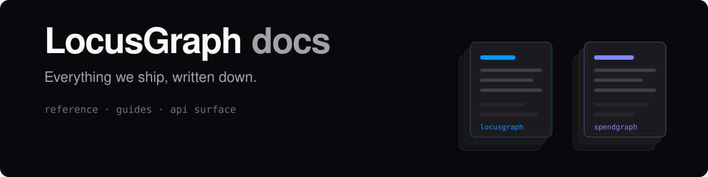

<p align="center">
  
</p>

<p align="center">
  <a href="https://docs.locusgraph.com"><strong>docs.locusgraph.com</strong></a> ·
  <a href="https://docs.locusgraph.com/locusgraph">LocusGraph</a> ·
  <a href="https://docs.locusgraph.com/spendgraph">Spendgraph</a> ·
  <a href="https://docs.locusgraph.com/llms.txt">llms.txt</a>
</p>

---

Documentation for every LocusGraph product, on one host. Marketing lives on
`www.locusgraph.com`; a page here is documentation or it does not belong here.

## [LocusGraph](https://docs.locusgraph.com/locusgraph)

A memory that lasts, for the things your app learns.

[Overview](https://docs.locusgraph.com/locusgraph/overview) ·
[Quickstart](https://docs.locusgraph.com/locusgraph/quickstart) ·
[Concepts](https://docs.locusgraph.com/locusgraph/concepts)

| | | |
| --- | --- | --- |
| [Use cases](https://docs.locusgraph.com/locusgraph/use-cases/preferences) | 6 | The shapes this gets used in most |
| [Client](https://docs.locusgraph.com/locusgraph/client/install) | 6 | Installing the SDK, connecting it, and what it throws |
| [Remember](https://docs.locusgraph.com/locusgraph/remember/store) | 5 | Writing what your app learns, one event or a thousand |
| [Recall](https://docs.locusgraph.com/locusgraph/recall/search) | 4 | Searching by meaning, and reading what comes back |
| [Contexts](https://docs.locusgraph.com/locusgraph/contexts/overview) | 4 | Grouping memories, and the links between those groups |
| [Review](https://docs.locusgraph.com/locusgraph/review/observe) | 3 | Proposing memories, and deciding which are kept |
| [Graphs](https://docs.locusgraph.com/locusgraph/graphs/create) | 4 | The container everything is stored in, and who reaches it |
| [Enterprise](https://docs.locusgraph.com/locusgraph/enterprise/security) | 5 | Running LocusGraph at company scale |

## [Spendgraph](https://docs.locusgraph.com/spendgraph)

Know what every token costs.

[Overview](https://docs.locusgraph.com/spendgraph/overview) ·
[Getting started](https://docs.locusgraph.com/spendgraph/getting-started) ·
[Concepts](https://docs.locusgraph.com/spendgraph/concepts)

Ten packages, listed in the order each is built on the one above it.

| | | |
| --- | --- | --- |
| [SDK](https://docs.locusgraph.com/spendgraph/sdk/quickstart) | 7 | Report what your app spends, and read it back |
| [LLMs](https://docs.locusgraph.com/spendgraph/llms/overview) | 6 | Call any provider, get one shape back |
| [Prompts](https://docs.locusgraph.com/spendgraph/prompt/overview) | 6 | Stored or written in code, rendered and recorded |
| [Stage](https://docs.locusgraph.com/spendgraph/stage/overview) | 5 | One prompt, one schema, one priced reply |
| [Tools](https://docs.locusgraph.com/spendgraph/tools/overview) | 9 | Declare once, offer the right few, record the turn |
| [Graph](https://docs.locusgraph.com/spendgraph/graph/overview) | 6 | Nodes and edges in, a priced rollout out |
| [Harness](https://docs.locusgraph.com/spendgraph/harness/overview) | 11 | The seven shapes, with the pricing already attached |
| [Vigil](https://docs.locusgraph.com/spendgraph/vigil/getting-started) | 6 | Park a run that takes hours, and resume it |
| [Evals](https://docs.locusgraph.com/spendgraph/evals/getting-started) | 9 | Score model output, and tell a change from noise |
| [CLI](https://docs.locusgraph.com/spendgraph/cli/overview) | 5 | Drive the dashboard from a terminal |

## For agents

[`/llms.txt`](https://docs.locusgraph.com/llms.txt) maps every page, each with
its own description. Append `.md` to any documentation URL for that page as
markdown rather than a page of HTML, or take
[`/llms-full.txt`](https://docs.locusgraph.com/llms-full.txt) for the whole
corpus in one request.

```
https://docs.locusgraph.com/locusgraph/concepts.md
```

## Not listed yet

`BrainStorm` and `Locus Skill` have routes and no pages. They stay off the host
index while `ready: false` in `lib/site/products.ts`.

## License

Two licences, split by what a file is rather than what it renders.

| | |
| --- | --- |
| Code, the app that serves the docs | [Apache 2.0](./LICENSE) |
| Prose and diagrams, under `content/` | [CC BY 4.0](./LICENSE-CONTENT) |

Neither grants any right to the LocusGraph or Spendgraph names or marks.
Spendgraph pages are not in this repository: they ship in
[`@spendgraph/docs`](https://www.npmjs.com/package/@spendgraph/docs) under its
own Apache 2.0 licence.
